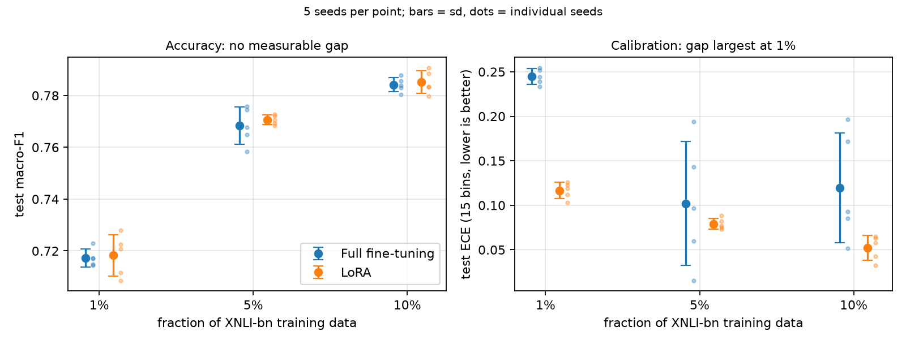
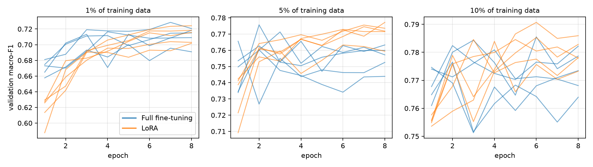

# Bangla NLI: LoRA vs Full Fine-tuning

**BSc thesis code and results.** A matched-budget comparison of LoRA (Low-Rank
Adaptation) against full fine-tuning of [BanglaBERT](https://huggingface.co/csebuetnlp/banglabert)
on the [XNLI-BN](https://huggingface.co/datasets/csebuetnlp/xnli_bn) 3-class natural language
inference task, run at 1%, 5%, and 10% of the training data with five random seeds per cell
(30 runs).

> **Author:** Arman Mahmud · **Base model:** `csebuetnlp/banglabert` · **Task:** 3-class NLI
> (entailment / neutral / contradiction) · **Dataset:** `csebuetnlp/xnli_bn`

Every number below is recomputed from the shipped artifacts by
[`scripts/step12_paper_stats.py`](scripts/step12_paper_stats.py); its full output is in
[`docs/stats_output.txt`](docs/stats_output.txt).

---

## Headline result

**No measurable accuracy difference between LoRA and full fine-tuning at any of the three data
sizes** (test macro-F1 gaps of +0.0010 to +0.0024, every 95% CI spans zero and lies
within ±0.0125). No equivalence margin was fixed before the experiment, so no formal
equivalence (TOST) claim is made; the 90% CIs would support margins of ±0.0059 (1%),
±0.0100 (5%) and ±0.0065 (10%). Swapping six replaced runs back in (see
[Replaced runs](#replaced-runs)) does not change this conclusion.

LoRA reaches this while training **0.80% of the parameters** (887,811 of 110,619,651),
shipping a **124× smaller artefact** (3.57 MB vs 442.51 MB), and using **25% less peak GPU
memory on a T4** and **42% less on an A100**.

**Retracted claim: LoRA is not faster to train on server-class hardware.** It trains
1.5–2.1× faster than full fine-tuning on a T4, but on an A100 it is at parity at 1% and
~6–7% *slower* wall-clock at 5% and 10%. It is also 1.6–2.7× slower to reach the checkpoint
that is kept, because it peaks later. The T4 and A100 runs also used different library
versions (see [Hardware and software](#hardware-and-software)), so the reversal cannot be
attributed to the GPU alone.



Three further findings from the same 30 runs:

- **At 1% data, full fine-tuning is badly overconfident**: ECE 0.245 vs 0.117 for LoRA,
  5 of 5 seeds agree, paired 95% CI on the gap [−0.139, −0.117]. It is 96.0% confident
  on average at 71.6% accuracy; LoRA is 83.4% confident at 71.7%. At 5% and 10% the gap is
  smaller and not significant (p = 0.48 and p = 0.085), driven by large seed-to-seed
  swings in full fine-tuning's ECE (sd 0.070 and 0.062). This is three measured points, not
  a trend.
- **The methods converge on different schedules at 5%**: full fine-tuning's best epoch is
  1–4, LoRA's is 6–8, with no overlap across seeds (paired gap +4.4 epochs, 5 of 5 seeds,
  p = 0.0001). Full fine-tuning then loses 0.0123 ± 0.0058 dev macro-F1 by epoch 8.
- **Equal accuracy, different models**: the two methods agree on only 83.9% (1%) to 86.9%
  (10%) of individual test predictions.



---

## Experiment setup

| Component | Setting |
|---|---|
| Base model | `csebuetnlp/banglabert` (110,619,651 parameters) |
| Task | 3-class NLI (entailment / neutral / contradiction) |
| Dataset | `csebuetnlp/xnli_bn`, parquet revision |
| Splits | 381,449 train / 2,419 validation / 4,895 test |
| Preprocessing | `csebuetnlp/normalizer` on both sentences, `max_length=128`, pad to max |
| Full fine-tuning | all parameters, learning rate `2e-5` |
| LoRA | `r=8`, `alpha=16`, `dropout=0.1`, adapters on `query` and `value`, LR `2e-4` |
| Precision | fp16 for all 30 runs |
| Batch size | 16 train / 64 eval |
| Epoch budget | **fixed 8 epochs for both methods, no early stopping** |
| Selection | best epoch chosen on validation macro-F1; test scored **once** per run |
| Data subsets | `train.shuffle(seed=seed).select(range(n))`, nested across fractions |

**Why fixed 8 epochs, no early stopping.** In a pilot, patience-2 cut full fine-tuning off at
epoch 4 with its best at epoch 2, while LoRA ran to convergence. Removing early stopping
recovered +0.0161 macro-F1 for full fine-tuning alone. A shared ceiling is the honest budget.

**Limitation: the ceiling still binds LoRA at 1%.** LoRA's best epoch is the last one (8)
in 4 of 5 seeds at 1% (full fine-tuning: 2 of 5). LoRA may still have been improving there,
so the 1% accuracy comparison is conditional on the 8-epoch budget.

**Why select on macro-F1, not validation loss.** Macro-F1 is the reported metric, and the
two disagree. At 5%, full fine-tuning's validation loss climbs from 0.64 at epoch 1 to 1.58
at epoch 8 (seed means) while macro-F1 peaks at epochs 1–4. Loss-based selection would have
picked a worse checkpoint in 2 of 5 seeds, costing 0.012 and 0.022 dev macro-F1.

---

## Repo layout

```
bangla-nli-lora-vs-fullft/
├── README.md
├── LICENSE                                    MIT
├── requirements.txt
├── notebooks/
│   └── Step10_retrain_ColabA100.ipynb         end-to-end Colab pipeline (produced the A100 runs)
├── scripts/
│   ├── step3_data.py                          data loading, normalisation, tokenisation
│   ├── step10_train_with_test.py              training engine (= notebook cell 4), runs standalone
│   ├── step11_analysis.py                     notebook cell 9: tables, McNemar, bootstrap, efficiency
│   └── step12_paper_stats.py                  every README number: CIs, Holm, ECE, temperature scaling, replaced-run check
├── figures/                                   written by step12
├── docs/
│   └── stats_output.txt                       full output of step12 on the shipped artifacts
└── step10_artifacts/                          the 30-run evidence base
    ├── results_v2.csv                         one row per run
    ├── superseded_runs.csv                    the 6 second-pass runs the A100 re-runs replaced
    ├── runs/<id>.json                         one manifest per run
    ├── curves_v2/<id>.json                    per-epoch dev curves
    └── preds/<id>_test.npz                    per-example test logits + labels
```

`scripts/step10_train_with_test.py` is the same engine the notebook embeds as cell 4 (the
code that produced the 16 A100 runs). The 14 T4 runs came from an earlier revision of that
engine that did not yet record reload verification; that revision is not shipped. The
3070-specific orchestration, the Colab-recovery utility and the superseded first-pass
evaluation were not used for the delivered runs and are not included.

---

## Reproducing

**The statistics (no GPU, about a minute):**

```bash
pip install numpy pandas scipy scikit-learn matplotlib
python scripts/step12_paper_stats.py            # tables to stdout, figures to figures/
PROJECT_DIR=step10_artifacts python scripts/step11_analysis.py
```

**A training run, on the command line:**

```bash
pip install -r requirements.txt
pip install git+https://github.com/csebuetnlp/normalizer
PROJECT_DIR=./thesis_runs SCRATCH_CKPT=/tmp/ckpt \
  python scripts/step10_train_with_test.py --fractions 0.01 --seeds 42
```

`--plan` prints the time estimate without training. Each `(method, fraction, seed)` writes
`runs/<id>.json`, `curves_v2/<id>.json` and `preds/<id>_test.npz` under `PROJECT_DIR`.

**In Colab:** open `notebooks/Step10_retrain_ColabA100.ipynb`, run the dependency cell,
restart the runtime as instructed, then run all cells. `PROJECT_DIR` defaults to
`/content/drive/MyDrive/thesis_bangla_nli`.

### Hardware and software

Read from the run manifests:

| GPU | Runs | transformers | peft | torch | Fractions |
|---|---|---|---|---|---|
| Tesla T4 | 14 | 5.15.0 | 0.20.0 | 2.11.0 | 1% (8 runs), 5% (6 runs) |
| A100-SXM4-40GB | 16 | 4.54.1 | 0.14.0 | 2.11.0 | 1% (2), 5% (4), 10% (10) |

Every (fraction, seed) pair ran on one GPU with one library stack, so the paired
LoRA-vs-full comparisons never mix hardware or versions. Pooled means do. Wall-clock and
peak memory are **never** pooled across GPUs.

---

## Results (30 runs, 5 seeds per cell)

**Accuracy: no measurable difference at any fraction:**

| Fraction | Full FT (test macro-F1) | LoRA (test macro-F1) | Gap (LoRA − full) | 95% CI | Paired p | Smallest margin the 90% CI supports |
|---|---|---|---|---|---|---|
| 0.01 (3,814 examples)  | 0.7172 (sd 0.0034) | 0.7183 (sd 0.0080) | +0.0010 | [−0.0054, +0.0074] | 0.685 | ±0.0059 |
| 0.05 (19,072 examples) | 0.7683 (sd 0.0072) | 0.7706 (sd 0.0019) | +0.0024 | [−0.0076, +0.0123] | 0.547 | ±0.0100 |
| 0.10 (38,144 examples) | 0.7842 (sd 0.0027) | 0.7851 (sd 0.0044) | +0.0010 | [−0.0062, +0.0082] | 0.728 | ±0.0065 |

The last column is descriptive. It is not a TOST result, because no margin was specified
before the data were seen. Running TOST requires a margin justified independently of these
results (`--margin` on `step12_paper_stats.py`). An earlier version of this README used
±0.0068, which was the largest drift among the six replaced runs below. That is post hoc,
derived from runs inside the comparison, and measures a change of GPU and library stack
rather than re-run noise, so it is withdrawn.

Per-seed McNemar: 1 of 15 tests reaches p < 0.05 (5%, seed 42), and none survives Holm
correction.

**Efficiency (parameters and artefact size hold regardless of hardware):**

| Metric | Full fine-tuning | LoRA | Ratio |
|---|---|---|---|
| Trainable parameters | 110,619,651 | 887,811 | **0.80%**, 125× fewer |
| Artefact on disk | 442.51 MB | 3.57 MB | **124× smaller** |
| Peak GPU memory (A100) | 2,712 MB | 1,570 MB | **−42%** |
| Peak GPU memory (T4) | 2,418 MB | 1,805 MB | **−25%** |
| Training throughput, T4 (samples/s) | 89.5 | 156.2 | LoRA **1.7× faster** |
| Training throughput, A100 (samples/s) | 268.4 | 253.1 | LoRA **~6% slower** |

**Calibration (ECE, 15 equal-width bins), strongest at 1%:**

| Fraction | Full FT ECE | LoRA ECE | ΔECE (LoRA − full) | 95% CI | Paired p | Seeds LoRA better |
|---|---|---|---|---|---|---|
| 0.01 | 0.245 (sd 0.009) | 0.117 (sd 0.009) | **−0.128** | [−0.139, −0.117] | 5 × 10⁻⁶ | 5/5 |
| 0.05 | 0.102 (sd 0.070) | 0.079 (sd 0.006) | −0.023 | [−0.103, +0.058] | 0.48 | 3/5 |
| 0.10 | 0.120 (sd 0.062) | 0.052 (sd 0.014) | −0.067 | [−0.150, +0.015] | 0.085 | 4/5 |

Temperature scaling shrinks the 1% gap but does not remove it: −0.128 → −0.027, 95% CI
[−0.043, −0.011]. Only test logits were saved, so the temperature is **cross-fitted on the
test set** (fit on one half, score the other, swap, average). This is a sensitivity check,
not a dev-set calibration result, and with 5 seeds it carries no multiplicity correction.

The likely mechanism is checkpoint selection. Full fine-tuning's best epoch scatters far
more across seeds than LoRA's, and its ECE varies with it. This is a property of this
protocol, not a demonstrated property of low-rank adaptation.

**Best (dev-selected) epoch:**

| Fraction | Full FT | LoRA | Paired gap | LoRA later | p |
|---|---|---|---|---|---|
| 0.01 | 5, 5, 7, 8, 8 (mean 6.6) | 7, 8, 8, 8, 8 (mean 7.8) | +1.2 | 3/5 | 0.11 |
| 0.05 | 1, 2, 2, 3, 4 (mean 2.4) | 6, 6, 7, 7, 8 (mean 6.8) | **+4.4** | **5/5** | **0.0001** |
| 0.10 | 1, 2, 2, 4, 6 (mean 3.0) | 3, 4, 5, 6, 6 (mean 4.8) | +1.8 | 3/5 | 0.22 |

**Same accuracy, different model:** the methods agree on 83.9% (1%), 86.6% (5%) and
86.9% (10%) of test predictions. At 1%, summed over the five seeds, full fine-tuning is
right where LoRA is wrong on 1,703 items and the reverse on 1,728. These are errors that
cancel out to the same score.

### Replaced runs

Six runs in the delivered grid are A100 re-runs that replaced earlier second-pass runs of the
same configuration: the 1% seed-42 pilot pair (originally on a T4) and the two 5% pairs
for seeds 21 and 33 (originally on a local RTX 5060). The originals' test macro-F1 is in
[`step10_artifacts/superseded_runs.csv`](step10_artifacts/superseded_runs.csv). Their
manifests and logits are not shipped, so only the accuracy table can be checked against them.

| Run | Original | A100 re-run | Change |
|---|---|---|---|
| full_ft 1% seed 42 | 0.7235 (T4, transformers 5.15.0) | 0.7170 | −0.0065 |
| lora 1% seed 42 | 0.7222 (T4, transformers 5.15.0) | 0.7225 | +0.0003 |
| full_ft 5% seed 21 | 0.7707 (5060, transformers 5.16.1) | 0.7746 | +0.0039 |
| full_ft 5% seed 33 | 0.7738 (5060, transformers 5.16.1) | 0.7677 | −0.0061 |
| lora 5% seed 21 | 0.7625 (5060, transformers 5.16.1) | 0.7693 | +0.0068 |
| lora 5% seed 33 | 0.7703 (5060, transformers 5.16.1) | 0.7683 | −0.0020 |

These are not identical re-runs: GPU, `transformers` (5.15/5.16 → 4.54.1), `peft`
(0.20 → 0.14) and, for the 5060 runs, `torch` (2.13 → 2.11) all changed. Single-run test
macro-F1 moved by up to 0.0068, the same size as the method gaps.

All three replaced pairs moved toward LoRA (LoRA − full: 1% seed 42 −0.0013 → +0.0055;
5% seed 21 −0.0082 → −0.0053; 5% seed 33 −0.0035 → +0.0006). With three pairs this happens
by chance one time in four, but it shifts the mean gaps, so both versions are reported:

| Fraction | Delivered grid: gap, 95% CI, p | With originals substituted: gap, 95% CI, p |
|---|---|---|
| 0.01 | +0.0010 [−0.0054, +0.0074], 0.685 | −0.0004 [−0.0060, +0.0053], 0.871 |
| 0.05 | +0.0024 [−0.0076, +0.0123], 0.547 | +0.0009 [−0.0104, +0.0123], 0.827 |

The conclusion is the same in both: no measurable difference. The calibration, convergence
and agreement results use per-example logits, which exist only for the delivered runs.

---

## What NOT to claim from these runs

- ~~Any test-set claim at 25%, 50% or 100% of the data~~: only 1%, 5% and 10% exist.
- ~~"LoRA and full fine-tuning are statistically equivalent"~~: no margin was
  pre-specified, so no TOST claim is valid. "No measurable difference" holds at all three
  fractions, in both the delivered and the substituted grid.
- ~~"Every gap is below the reproducibility floor"~~: the ±0.0068 "floor" came from
  runs that changed GPU and library version, not from identical re-runs.
- ~~"LoRA trains faster"~~ as a general claim: true on a T4, false on an A100, and the two
  GPUs also differ in library version.
- ~~"LoRA is more stable across seeds"~~: the direction of the standard-deviation
  difference flips by metric and fraction.
- ~~Pooled McNemar~~: invalid, because it reuses the same test items five times.
- ~~Anything phrased "as data scales"~~: three x-values are three points, not a scaling
  curve. The calibration gap is non-monotone across them.
- ~~"LoRA is better calibrated" as a general property~~: only the 1% gap is significant,
  and it traces to checkpoint-selection instability under this protocol.
- ~~"The epoch budget was sufficient for both methods at every fraction"~~: LoRA hit the
  8-epoch ceiling in 4 of 5 seeds at 1%.

---

## Data-integrity checks on the 30 runs

| Check | Result |
|---|---|
| Runs delivered | 30 (fractions 0.01/0.05/0.10, seeds 7/13/21/33/42, both methods) |
| Settings identical across all 30 | fp16, batch 16, ceiling 8, 1 eval/epoch, no patience |
| Early stopping | never fired |
| Evaluation coverage | `evals_ran == evals_possible` in all 30 |
| Dev score at restored checkpoint vs curve | `max abs(dev_reload_drift) = 0.0` across all 30 |
| Saved-model reload, test logits | `reload_max_logit_drift = 0.0` on all 16 A100 runs (not recorded for T4 runs) |
| (fraction, seed) pairs split across GPUs | 0 |
| Replaced runs | 6 second-pass runs replaced by A100 re-runs; originals in `superseded_runs.csv`, sensitivity check above |

---

## Citing

If you use this code or results, please cite the thesis (BibTeX to follow after submission).

## License

MIT, see [`LICENSE`](LICENSE).

## Acknowledgements

- CSE-BUET NLP for the [BanglaBERT](https://huggingface.co/csebuetnlp/banglabert) model and
  the [XNLI-BN](https://huggingface.co/datasets/csebuetnlp/xnli_bn) dataset.
- Hugging Face `transformers` and `peft` for the training and LoRA implementations.
